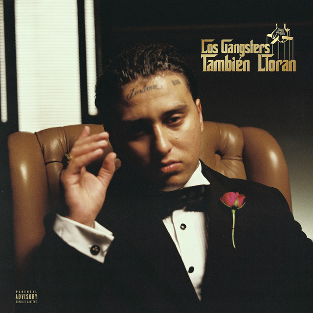

## Integrantes del grupo

- Jose Bravo [cuentaGithub](https://github.com/Eiivor07)
- Romina Insotroza [cuentaGithub](https://github.com/Dezcontinuado)

## Descripción del disco



- "Los gangsters también lloran"
- 2024, 29 de Marzo
- Pablo Chill-E
- Tracklist

```txt
1. LGTLL (feat. Drago 200)
2. Resentia
3. Bastardo (feat. Ñengo Flow & Jere Klein)
4. Carita Triste
5. Gitana (feat. Bryartz)
6. Bandida (feat. EL BAI)
7. Pensando En Ti (feat. Casper Magico)- Remix
8. Cora Rto (feat. pailita)
```
- Código final

> [Código-p5js](https://editor.p5js.org/josebravogranja2007/sketches/bcZJsvNKR)

- Aspecto del álbum a desarrollar (premisa)

> El disco está construido sobre la contradicción entre dureza callejera y vulnerabilidad afectiva.
> La estética del mafioso clásico y de la sensivilidad emocional.
> Sonido más íntimo y barrial.
> Mezcla entre poder, tristeza, calle y romanticismo roto.


## Conclusión del proceso

> ¿Cómo se compara lo que querían desarrollar con el resultado final?
Queríamos crear una experiencia basada en el albúm "Los Gangsters tambien lloran" de Pablo Chill-E, con una atmósfera urbana, triste y callejera.
Visualmente se logró esa ciudad oscura y detallada. Sin embargo, en el juego real, terminó siendo un minijuego muy sencillo de esquivar balas amarillas que caen. 

⁠> ¿Lograste desarrollar los aspectos que querías? Si, no ¿cuáles?
El fondo quedó genial. El barrio se siente vivo porque las ventanas se encienden y apagan solas, y los controles para moverse de izquierda a derecha funcionan perfectamente,
lo que faltó desarrollar fue el personaje es solo un rectángulo negro. Faltó dibujarlo como un "gangster" de verdad, también sentimos que faltó un sistema de puntaje.

⁠> ¿Qué aspectos emergieron?
Al final, el juego transmite la sensación del álbum, de el gangster en el barrio con una escena melancólica, esquivando balas. 
El proyecto se centró mucho más en los detalles del dibujo (cables, postes, luces) que en ponerle mecánicas complejas al juego.


## Explicación del código (3 aspectos)

### 1-Movimiento del personaje
El movimiento en dos dimensiones se basa en cambiar la posición de un objeto a lo largo del tiempo sumando o restando píxeles en su eje horizontal (X).

¿Cómo funciona?

La variable de posición: Creamos una variable (jugadorX) que guarda en qué píxel de la pantalla está parado el personaje.
El detector de teclado: Usamos keyIsDown(). Esta función de p5.js revisa si una tecla está presionada en ese milisegundo exacto.
Suma y resta: Si presionas la A, restamos píxeles a la posición (el personaje se mueve a la izquierda). Si presionas la D, sumamos píxeles (se mueve a la derecha).
La función constrain(): Para evitar que el personaje desaparezca por los lados de la pantalla, esta función bloquea el valor de jugadorX entre dos límites: el borde izquierdo (0)
y el borde derecho (width - anchoJugador)

```js
if (keyIsDown(65)) {
    jugadorX = jugadorX - velocidadJugador;
    mostrarInstrucciones = false; 
  }
  if (keyIsDown(68)) {
    jugadorX = jugadorX + velocidadJugador;
    mostrarInstrucciones = false; 
  }

  // Restringir movimiento al ancho de la pantalla
  jugadorX = constrain(jugadorX, 0, width - anchoJugador);
```

### 2-Líneas cayendo
Hacer una "lluvia" o ráfaga de objetos requiere manejar múltiples elementos que nacen, se mueven y se reciclan de forma independiente. Para esto usamos listas (arrays).
¿Cómo funciona la lógica?

Listas paralelas: Usamos lineasX y lineasY como archivadores. Si tenemos 5 líneas en pantalla, lineasX[0] y lineasY[0] guardan la ubicación de la primera línea, lineasX[1] y lineasY[1] la de la segunda, y así sucesivamente.
El temporizador (%): No podemos crear una línea en cada fotograma porque serían demasiadas (60 por segundo). Usamos frameCount % 25 === 0 para que el juego fabrique una línea nueva solo cada 25 fotogramas.
Nacimiento (.push()): Cuando el temporizador se activa, inventamos una X aleatoria con random() y ponemos la Y en -10 (arriba del techo).
Usamos .push() para meter estos dos números al final de nuestras listas.

El ciclo for (Animación y Limpieza): Un bucle recorre las listas de arriba a abajo para sumarle velocidad a cada coordenada Y (haciendo que caigan) y dibujarlas.
Si la Y de una línea supera el alto de la pantalla (height), usamos .splice(i, 1) para borrarla de la lista y que la computadora no trabaje de más guardando objetos invisibles.

```js

  // __________________ OBSTÁCULOS Y COLISIONES ________________
  // Crear una nueva línea cada 20 fotogramas 
  if (frameCount % 20 === 0) {
    lineasX.push(random(0, width - anchoLinea));
    lineasY.push(-altoLinea); 
  }

  // Mover y dibujar las líneas
  for (let i = 0; i < lineasY.length; i++) {
    // Movimiento hacia abajo
    lineasY[i] = lineasY[i] + velocidadLineas;

    //  línea 
    fill(230, 175, 46); 
    rect(lineasX[i], lineasY[i], anchoLinea, altoLinea);

    //  colisión
    if (lineasX[i] < jugadorX + anchoJugador &&
        lineasX[i] + anchoLinea > jugadorX &&
        lineasY[i] < jugadorY + altoJugador &&
        lineasY[i] + altoLinea > jugadorY) {
      
      juegoTerminado = true;
    }
  }
```

### 3-Ventanas parpadeantes
Las ventanas parpadearan para crear una atmosfera mas real y que le de vida al minijuego estas funcionan entendiendo el principio de modulación ya que cada ventana es un objeto independiente al cual se le asigna un tiempo random w.timer = int(random(120, 400)); junto a las función for (let p of positions) que va revisarndo una por una. 

```js
 for (let p of positions) {
    windows.push({
      x: p[0], 
      y: p[1],
      blinds: p[2],
      on: random() > 0.3,
      timer: int(random(80, 300))
    });
  }
}

function updateWindows() {
  for (let w of windows) {
    w.timer--;
    if (w.timer <= 0) {
      w.on = random() > 0.3;
      w.timer = int(random(120, 400));
    }
    drawWindow(w.x, w.y, w.blinds, w.on);
  }
```

### Declaración sobre el uso de IA

- IA utilizada(s) y tipo de licencia (pago, gratuita)

> Chatgpt gratis y Gemeni gratis

1. Efecto de encendido y apagado de las ventanas
2. Lluvia
3. Lograr que el personaje se mueva dentro del eje x
4. La funcionalidad de videojuego 

- Prompts utilizados

> Prompt 1: Como lograr que las ventanas en una animación de p5sj se encienden y apaguen.

> Prompt 2: Eran dudas ocacionales al respecto de como funcionaba

> Prompt 3 y 4: En p5.js quiero hacer un minijuego, explicame paso a paso como puedo hacer que caigan lineas que al colisionar con el personaje que se mueve de izquierda a derecha con "A y D" el juego termine y se tenga que reiniciar con click


- Secciones de código entregadas por la IA

```js
let jugadorX = 200;
let jugadorY = 450;
let anchoJugador = 30;
let altoJugador = 60;
let velocidadJugador = 6;


// Balas (Líneas amarillas)
let lineasX = [];
let lineasY = [];
let anchoLinea = 5;
let altoLinea = 10;
let velocidadLineas = 5;


// Control del estado del juego
let juegoTerminado = false;
let mostrarInstrucciones = true; // Controla el mensaje del inicio


function setup() {
  createCanvas(500, 500);
}


function draw() {
  // Fondo
  background(171, 155, 150);


  // __________________________ GENERACIÓN CONTINUA __________________________
  
  // Crear una nueva línea cada 25 fotogramas continuamente de fondo
  if (frameCount % 25 === 0) {
    lineasX.push(random(0, width - anchoLinea));
    lineasY.push(-altoLinea); // Aparece justo arriba de la pantalla
  }


  // __________________________ MOVIMIENTO Y DIBUJO DE BALAS __________________________
  
  for (let i = 0; i < lineasY.length; i++) {
    
    // Si el juego está activo, las líneas se mueven hacia abajo
    if (!juegoTerminado) {
      lineasY[i] = lineasY[i] + velocidadLineas;
    }


    // Dibujar línea (Amarillo constructivista) - Se dibujan siempre de fondo
    fill(230, 175, 46); 
    noStroke();
    rect(lineasX[i], lineasY[i], anchoLinea, altoLinea);


    // _________________________ COLISIÓN _________________________
    
    // Revisar si la línea cruza el espacio del jugador (solo si sigue vivo)
    if (!juegoTerminado) {
      if (lineasX[i] < jugadorX + anchoJugador &&
          lineasX[i] + anchoLinea > jugadorX &&
          lineasY[i] < jugadorY + altoJugador &&
          lineasY[i] + altoLinea > jugadorY) {
        
        juegoTerminado = true;
      }
    }
    
    // Optimización: Eliminar líneas que salen de la pantalla para evitar lentitud
    if (lineasY[i] > height) {
      lineasX.splice(i, 1);
      lineasY.splice(i, 1);
      i--; // Ajusta el índice para no saltarse la siguiente línea en la lista
    }
  }


  // ___________________________ JUGADOR Y ELEMENTOS ACTIVOS ___________________________
  
  if (!juegoTerminado) {
    // Controles con teclado: Tecla A (65) y Tecla D (68)
    if (keyIsDown(65)) {
      jugadorX = jugadorX - velocidadJugador;
      mostrarInstrucciones = false; // Quita el mensaje al moverte
    }
    if (keyIsDown(68)) {
      jugadorX = jugadorX + velocidadJugador;
      mostrarInstrucciones = false; // Quita el mensaje al moverte
    }


    // Restringir que el jugador no se salga de la pantalla
    jugadorX = constrain(jugadorX, 0, width - anchoJugador);


    // Dibujar personaje (Negro)
    fill(0, 0, 0); 
    rect(jugadorX, jugadorY, anchoJugador, altoJugador);


    // ________________________ INSTRUCCIONES ________________________
    
    // Si el jugador no se ha movido todavía, muestra el aviso flotando arriba
    if (mostrarInstrucciones) {
      fill(0, 0, 0); 
      textFont('Monospace');
      textSize(16);
      textAlign(CENTER, CENTER);
      text("Pulsa A y D para moverte", width / 2, height / 4);
    }


  } else {
    // ________________________ PANTALLA GAME OVER OVERLAY ________________________
    
    // Capa de fondo oscuro semitransparente sobre los elementos congelados
    fill(78, 1, 16, 200); // Tono rojizo oscuro con transparencia (alfa)
    rect(0, 0, width, height);
    
    fill(255, 255, 255); // Texto blanco para que resalte
    textFont('Monospace');
    textAlign(CENTER, CENTER);
    
    // Texto principal
    textSize(32);
    text("Game Over", width / 2, height / 2);
    
    // Texto secundario más pequeño abajo
    textSize(16);
    text("Click para reiniciar", width / 2, height / 2 + 40);
  }
}


// Función nativa de p5.js para escuchar los clics del mouse
function mousePressed() {
  // Al hacer click estando en Game Over, se reinicia
  if (juegoTerminado) {
    lineasX = [];       // Vacía la lista de posiciones X
    lineasY = [];       // Vacía la lista de posiciones Y
    jugadorX = 200;     // Devuelve al personaje al centro
    juegoTerminado = false; // Devuelve el juego a su estado activo
    mostrarInstrucciones = true; // Vuelve a permitir que aparezca el aviso al reiniciar
  }
}

```
